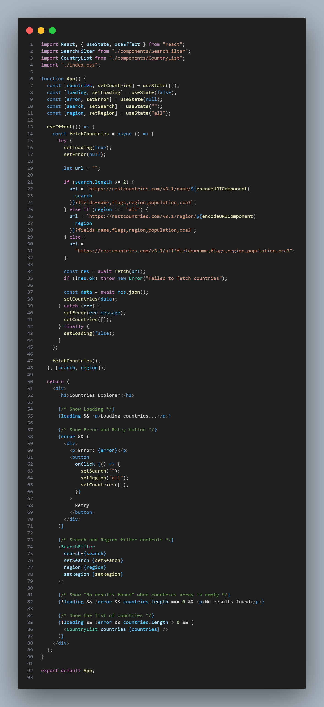
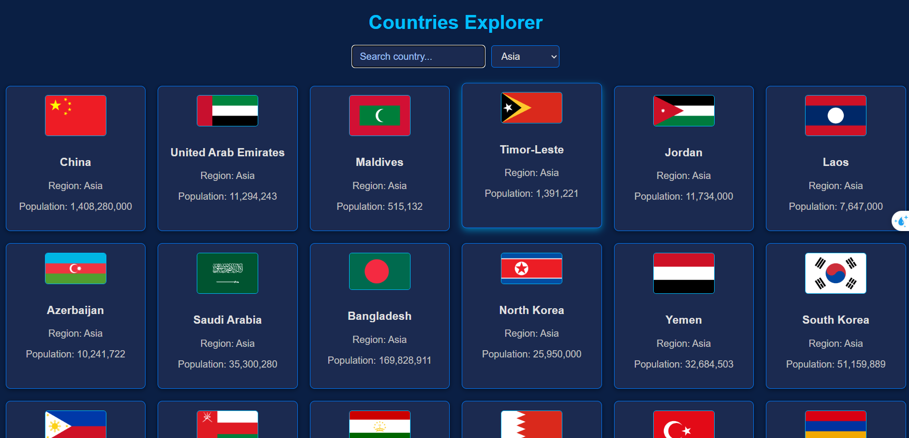

# Countries Explorer 🌍

A React app to explore countries with search and filter functionality.

---

## How to run

1. Clone the repo:  

2. Go to the project folder:  
   `cd countries-explorer`

3. Install dependencies:  
   `npm install`

4. Create the components (`SearchFilter.jsx`, `CountryCard.jsx`, `CountryList.jsx`) and import them in `App.jsx`.

5. In `App.jsx`, fetch country data using `useEffect`.

6. Start the app:  
   `npm start`

7. Open `http://localhost:3000` in your browser.

---

## API endpoints used

- All countries: `https://restcountries.com/v3.1/all?fields=name,flags,region,population,cca3`  
- Search by name: `https://restcountries.com/v3.1/name/{name}?fields=name,flags,region,population,cca3`  
- Filter by region: `https://restcountries.com/v3.1/region/{region}?fields=name,flags,region,population,cca3`

---

### Home Page

### Search Results

